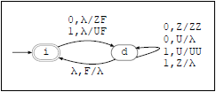

# Interpretador de Autômato Pilha Determinístico

Autores:

* Raphael Assis

* Gleiston Guimarães

## 1) Objetivo 

O objetivo desse trabalho é permitir que os alunos apliquem os conceitos assimilados na disciplina de Linguagens formais e autômatos em um trabalho prático de implementação. A ideia é desenvolver um dos algoritmos em uma das máquinas/gramáticas vistas na disciplina em um programa de computador.

## 2) Descrição 

Implementar um programa que recebe um Autômato de Pilha Determinístico (APD) e testar para cada palavra de entrada se ela pertence ou não a linguagem. O programa pode ser desenvolvido em qualquer linguagem de programação, desde que exista compilador/interpretador disponível.

## 3) Instruções 

O programa deve receber uma especificação de um autômato de pilha M = (E, Σ, Γ, δ, i, F) no formato JSON conforme a seguinte especificação: 

```
{ "ap": [ 
	[e, ∀e ∈ E], 
	[a, ∀a ∈ Σ], 
	[x, ∀x ∈ Γ], 
	[ [e, a|#, b|#, e’, x+|#], δ(e, a|#, b|#) = [e’, x+|#] ],
	i ∈ I, 
	[f, ∀f ∈ F] 
]}
```

Considere uma linguagem onde as palavras contém o número de zeros igual ao números de uns: L = { w ∈ {0, 1}* | o número de 0s é igual ao número de 1s em w }. O diagrama APD dessa linguagem é dada a seguir com sua respectiva representação em JSON, onde # indica o símbolo λ:

 

```json
{ "ap": [
    ["i", "d"],
    ["0", "1"],
    ["Z", "U", "F"],
    [
        ["i", "0", "#", "d", "ZF"],
        ["i", "1", "#", "d", "UF"],
        ["d", "0", "Z", "d", "ZZ"],
        ["d", "0", "U", "d", "#"],
        ["d", "1", "U", "d", "UU"],
        ["d", "1", "Z", "d", "#"],
        ["d", "#", "F", "i", "#"]
    ],
    "i",
    ["i"]
]}
```

O programa deve receber por padrão o arquivo de entrada do APD no formato especificado em linha de comando e receber do teclado palavras de teste. Para cada palavra entrada responder "Sim" se ela pertence a linguagem e "Não" caso contrário. Nenhuma outra saída deve ser exibida, como depuração como por exemplo. O programa deve terminar ao receber CTRL+D. A seguir, é mostrada um exemplo de execução, onde a entrada de dados está em vermelho. Repare que # é usado novamente para representar λ.

```powershell
$ ./apd
Usar: ./apd [APD]
$ ./apd exemplo.json
#
Sim
0
Nao
1
Nao
00
Nao
01
Sim
10
Sim
11
Nao
1001
Sim
0101
Sim
1000
Nao
^D
$
```

